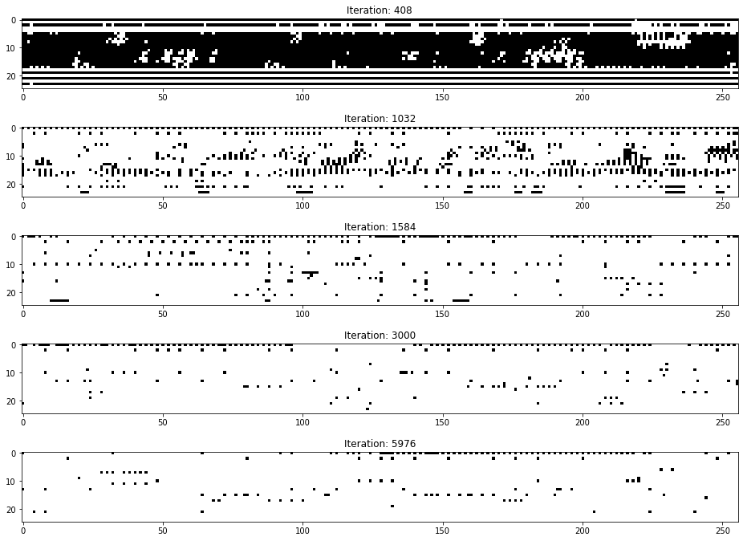

# Generative Adversarial Networks - Drum Pattern Generation
I love listening metal music, and especially black metal. In this project, I tried to generate similar drum patterns of my whole time favorite black metal drummer Maciej Kowalski aka Darkside from MGŁA and Kriegsmaschine. In order to achieve this, Generative Adversarial Networks(GANs) are used. This project covers the following steps:
* Data Collection
* Data Preprocessing
* Model Training
* Convert Images to Midi

You can listen couple of generated tracks by following this [link](https://soundcloud.com/oemer-faruk-kolcak/sets/ai-generated-darkside-drums).
## Data Collection
Based on my researches and similar projects made by others, midi files are the best option for this task. Midi files are symbolic music which means it is a collection of note events arrenged in different instruments over time. They are easy to work with and there are various python libraries to work on. Therefore, I searched through the internet to find midi files for MGŁA and Kriegsmaschine, but I could not find one single file since they are not that popular band. I had to find a different way, and one solution came to my mind. There is a website called [Ultimate-Guitar](https://www.ultimate-guitar.com/) where people transcript the songs and post guitar pro tabs. I downloaded tabs of 14 different tracks from MGŁA and Kriegsmaschine, and converted them to midi files from Guitar Pro 7 application. There could be minor mistakes, since the tabs are not published by original composers. In overall, they seem to be very accurate. 
## Data Preprocessing
Now that we have the midi files, drum channels should be extracted from each midi file. Drum channles are represented with 9 in the midi files, so it is simple extract  drums from the songs. After that, each drum channels should be converted to image represantion of the track. This requires the quantization. By appling quantization, we simply make sure that every note gets mapped into the time grid. After quantization, images can be generated for every drum track. Below image is an example from the dataset. <br/>


All the images in the dataset are 25x256, where height denotes the notes that are played in the time t which is denoted by width of the image. For example, in the above sample at time 0, 36th(Bass Drum) and 57th(Crash Cymbal 2) notes are played. It is important to note that we add 36 to every height index, because the minimum note played by Darkside is 36(Bass Drum). At time 1, there is no note to play. At time 2, just 36th note is played, and it keeps going like this. For every song, images are generated with step size of 128 which means there are overlap of 128. As a result, there are 783 images in the dataset.  
## Model Training
GAN model architecture is used from [here](https://machinelearningmastery.com/practical-guide-to-gan-failure-modes/) with minor modifications on the network. Latent space is set to 50. Model is trained for 6000 thousand iterations on GPU P100. The below figure shows the generated images at different epochs.  </br>


It is hard to evaluate the performance of GANs. There are different metrics like FID scores, KID scores, and others. Manually evaluating the models is another approach, and it is reliable but it requires human labouring. I evaluated manually by inspecting results of the model and listening the generated tracks. As above figure shows, first 400 epochs are very bad and completely random. In the 1000s iteration, it starts to improve but it is still random notes. The model starts to generate reasonable results by the 1500s iterations. In the iteration 3000s and 5000s, model generates really good results. You can experience with different models in the model/ folder.
## Image to Midi
Now that generator can generate the images, generated images should be converted to midi files. Images can be generated and converted to midi files as follows:
```
python generate_drum_patterns.py --bpm=100 --track-nums=10 --weights=models/model_5976.h5
```
